{fig-alt="fraud"}

_Note: I have never voted in a Presidential election, and am not registered as a member of any political party_
    
        
"The 2020 election was so...2020", that's the tagline we've settled on as a nation. Joe Biden's margin of victory was paper-thin in key states, often thinner than Trump's margins last election. Of course, those 2016 results were widely claimed to be suspicious, which lead to an investigation that [uncovered interference from](https://www.justice.gov/storage/report.pdf) (but [debunked many widely alleged theories about direct collusion with](https://taibbi.substack.com/p/russiagate-is-wmd-times-a-million)) Russia. 

<strong>Margin of Victory in Key States</strong>

<table style='width: 100%; max-width: 400px'>
  <thead>
    <tr>
      <th>&nbsp;</th>
      <th>2020</th>
      <th>2016</th>
    </tr>
  </thead>
  <tbody>
    <tr>
      <td>Wisconsin</td>
      <td class="dem">0.62%</td>
      <td class="rep">0.82%</td>
    </tr>
    <tr>
      <td>Michigan</td>
      <td class="dem">2.73%</td>
      <td class="rep">0.24%</td>
    </tr>
    <tr>
      <td>Georgia</td>
      <td class="dem">0.29%</td>
      <td class="rep">5.32%</td>
    </tr>
    <tr>
      <td>Arizona</td>
      <td class="dem">0.35%</td>
      <td class="rep">3.78%</td>
    </tr>
    <tr>
      <td>Pennsylvania</td>
      <td class="dem">0.79%</td>
      <td class="rep">0.75%</td>
    </tr>
  </tbody>
</table>

<em>Data Source: New York Times Election Maps</em>

This time it's the same story, with the party tables turned and the focus on internal voter fraud. The Trump campaign has already [filed several lawsuits](https://www.telegraph.co.uk/news/2020/11/11/what-happening-trump-lawsuit-recounts-postal-votes-us-election-2020/) in swing-states alleging election misconduct. Of course, anyone who's spent time on social media has seen their share of people [wondering aloud](https://twitter.com/jackposobiec/status/1325125670599495681?s=10) about the [integrity](https://twitter.com/critica18495985/status/1325307257056342016?s=10) of the [election](https://twitter.com/cernovich/status/1325168281259442184?s=10). Meanwhile the New York Times (along with other mainstream media) claims that [next-to-zero fraud occurred](https://www.nytimes.com/2020/11/10/us/politics/voting-fraud.html) (which is actually consistent with their [2016 views on the matter](https://www.nytimes.com/2016/12/18/us/voter-fraud.html)).

Given the focus on fraud, this election has been busy for hordes of indie data pundits (like me). Some are making [Deep State connections](https://twitter.com/monkeyjones1984/status/1325596977602519040?s=10) to hacked election machines, often in connection to the so-called [Hammer and Scorecard](https://joannenova.com.au/2020/11/cia-programs-designed-to-interfere-in-elections-hammer-and-scorecard/) CIA election interference software that we've allegedly turned against ourselves. Others are just hunting for [oddities and anomalies]( https://twitter.com/VC4351/status/1325554847031025665). One analyst made minor news when he raised over $200k via GoFundMe for investigating voting irregularities, only to have [GoFundMe cancel his campaign](https://www.politico.com/news/2020/11/06/gofundme-removes-conservative-fundraiser-election-misinformation-434800) citing that he was engaging in “attempts to spread misleading information."

One data investigation that caught my eye in particular (and the eyes of many others) was that of [Dr. Shiva Ayyadurai](https://en.wikipedia.org/wiki/Shiva_Ayyadurai). Dr. Ayyadurai claims to have invented email[^1], ran as a Republican for US senator in MA (but lost in primaries), and has almost 200k YouTube subscribers. His latest hour-long video was about a case of possible election fraud in Michigan. 



In the video, Ayyadurai outlines his team's analysis of the Michigan counties of Oakland, Macomb, and Kent, where voting data behaves "as though an algorithm was there...that's what we see here"

The video got a quarter-million views in less than 24 hours. Soon investing legend Michael Burry (Chrisian Bale's character in _The Big Short_) was [retweeting](https://twitter.com/michaeljburry/status/1326416897903128577). 

<blockquote class="twitter-tweet">
Consider these slides. Worth watching Shiva’s entire presentation for proper context, and deciding for yourself. <a href="https://twitter.com/hashtag/Election2020results?src=hash&amp;ref_src=twsrc%5Etfw">#Election2020results</a> are full of statistical anomalies that do not find easy explanation, but this is one possible explanation. <a href="https://twitter.com/hashtag/Question?src=hash&amp;ref_src=twsrc%5Etfw">#Question</a> <a href="https://twitter.com/hashtag/Election2020?src=hash&amp;ref_src=twsrc%5Etfw">#Election2020</a> <a href="https://t.co/3vpfZzqYUF">pic.twitter.com/3vpfZzqYUF</a>
&mdash; Michael Burry MD (@michaeljburry) <a href="https://twitter.com/michaeljburry/status/1326416897903128577?ref_src=twsrc%5Etfw">November 11, 2020</a></blockquote>

(He deleted these tweets soon after this article's writing)

I was intrigued and went down the rabbit hole myself. To get an idea for Ayyadurai's thesis, you can [watch his video stating at 13:05](https://youtu.be/Ztu5Y5obWPk?t=781), but I'll also explain his setup below. 

## Straight Ticket Voting: An Electoral Oddity

Ayyadurai's analysis centers around an odd aspect of Michigan voting: [straight ticket (or straight party) voting](https://en.wikipedia.org/wiki/Straight-ticket_voting). In a few states, Michigan one of them, you can skip voting for individual candidates for president, senate, congress, and other downballot offices. Instead, you can just check one box to vote for "The Democratic Party" (or "The Republican Party"), which automatically casts your votes to the Democrat (or Republican) candidates for every office on the ballot. It's basically a "select all" option.

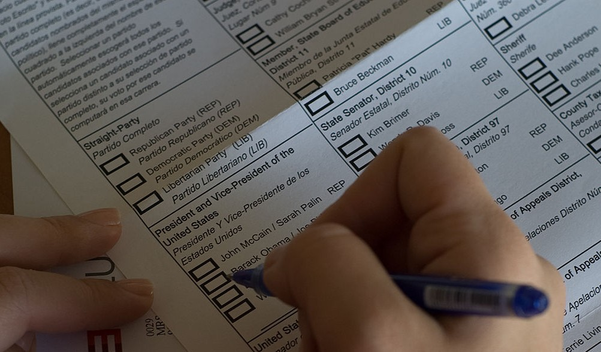

Ayyadurai's team created a data visualization by plotting the difference between the straight-ticket voting compared with the regular candidate-by-candidate voting (which I'll refer to as "mixed-ticket", since you can mix which parties you vote for when voting in this way). First, they organized precinct voting data as follows:

| Precinct   | Straight Ticket Votes | Overall Votes (Straight and Mixed Ticket) | Difference, Overall vs Straight Ticket |
| ---------- | --------------------- | ----------------------------------------- | -------------------------------------- |
| precinct 1 | 60% Trump             | 68% Trump                                 | 8%                                     |
| precinct 2 | 50% Trump             | 48% Trump                                 | -2%                                    |

For each precinct in a county, they show (2nd column from the left) what percentage of straight ticket votes went to Trump. Then they calculate how the overall vote went (3rd column from left), and finally look at the difference between the two. They visualize this data with a plot like so (here showing the example data from above):

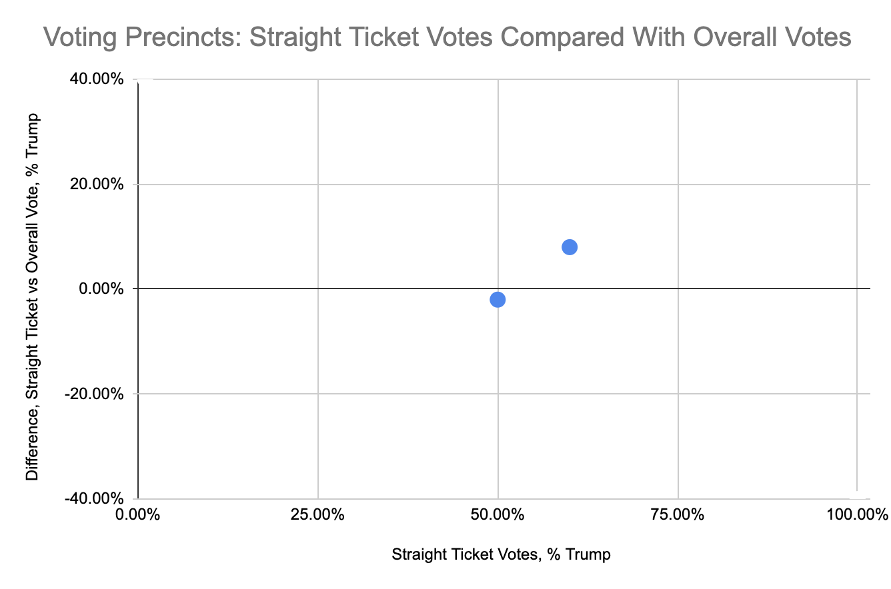

Their thesis is that **the straight-ticket voting patterns should be similar to the overall voting patterns**. 
So in a given precinct, if 60% of the straight-ticket votes were for Trump, Ayyadurai pretty reasonably theorizes that around 60% of the mixed party votes should also go to Trump, giving us a flat horizontal line in our plot. 

However, when Ayyadurai looked at the actual data from several Michigan counties, he found something much different: [a steep and highly significant downward trend](https://youtu.be/Ztu5Y5obWPk?t=1404), implying that the more Republican a precinct is, the more it tended to flip toward Biden. 

> It looks like his votes counts start getting linearly reduced and if you look at this curve and I've looked at lots of curves...anyone of us who's in the pattern analysis business when you see this...you say something's up. This is too structured, right? Too perfect.

He's right: this level of trend is something that anyone who's done data science usually loves to see: a very (very) strong correlation between two variables.

What's going on? This puzzled me too at first. Perhaps it's caused by "Romney Republicans" that don't like Trump? Well, Ayyadurai has an answer to that too: if Republicans showed a distaste for Trump, we still ought to see a flat chart, just shifted down. Something else is going on, and for Ayyadurai, the only option left to consider is a malicious algorithm. 

> And remember we've talked about it the election systems...they have the feature of being able to manipulate vote counts from one person to another. It's called a weighted race feature.

## Why Are The Most Republican Precincts Flipping Toward Biden?

That problem is, he's gotten slightly confused about what he's looking at. We are NOT actually comparing precincts by "how Republican they are". We are comparing _straight-ticket results_ to overall results. This is a small but very important difference. Why? When someone goes to the polls in Michigan, they first choose to either vote straight-ticket or mixed-ticket. **And they don't pick randomly**. This is what's called a [selection bias](https://en.wikipedia.org/wiki/Selection_bias#:~:text=Selection%20bias%20is%20the%20bias,to%20as%20the%20selection%20effect.) in data analysis. 

The voters that show up to the polls and check the "all Democrats" or "all Republicans" box are, by definition, more partisan voters than the voters that decide to pick and choose between both parties. If a precinct's straight-ticket votes (the votes from the _most_ partisan voters in the area) go very Trump, then yes, you would expect the definitionally _less_ partisan voters in the area (the mixed-ticket voters) to vote less strongly that way.

But won't some Biden supporters switch to Trump too? Yes, but not as many, because in a very Republican area Trump would have more to lose and less to gain. Let's go through a quick example. 

Say a precinct has 1000 constituents: 800 Republican, 200 Democrat. If 10% of the Republicans decide to flip, Trump loses 80 votes. If 10% of the Democrats decide to flip, Trump gains 20 votes, for a net loss of 60 votes. Given the selection bias at work, most of these flipping voters are going to do a mixed-ticket vote...if you are a Republican that hates Trump, you probably still want to vote GOP for Senate, etc. 

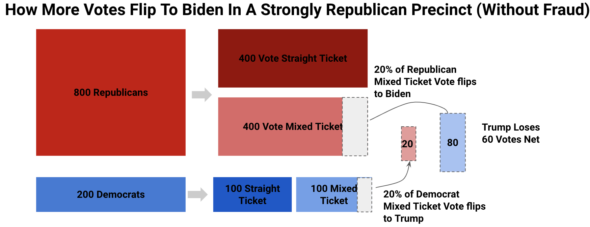
           
Ayyadurai would say here, 60 votes _got moved_ to Biden. But it's actually just that mixed-ticket voters are less likely (by definition) to vote with precinct norms, and will tend to move overall results back towards the center. 

All of this works the same way for more Democratic precincts; just do the same math but switch "Republican" and "Democrat", and "Trump" and "Biden". And if a precinct is split 50/50, there flipping votes net to zero. How does all this look on the precinct plots we've been looking at?

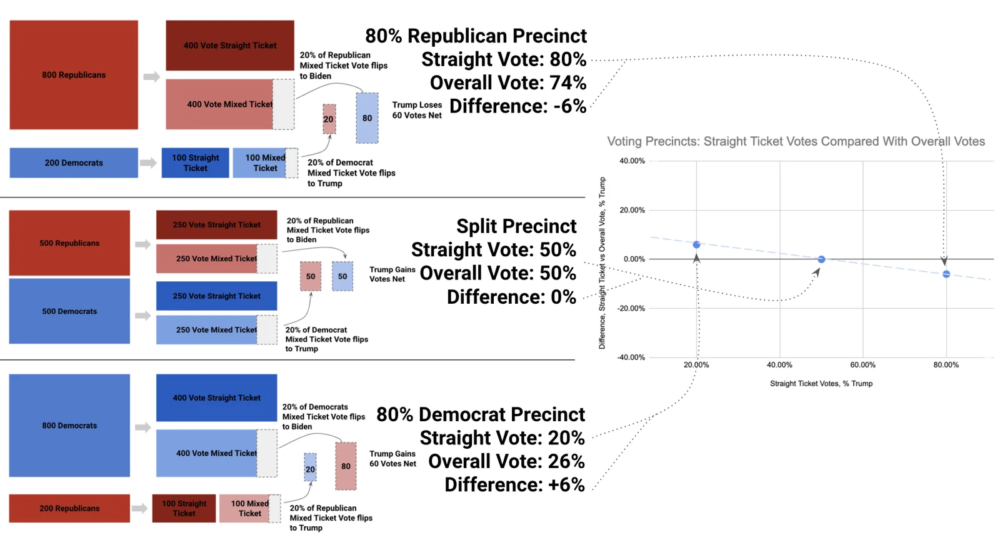

It's a nice downward sloping line. I've only done three data points, but you can see how the rest of the line fills in depending on how Republican or Democrat a precinct is. You can get a steeper line by increasing the percentage of mixed voters that flip (I used a rate of 20% in the example above), or shift the line up or down by making the flip percentage assymentical (e.g. 20% of Republicans flip, but only 10% of Democrats do). Add in some random variation, and this is exactly what we're seeing in Dr. Shiva's Michigan chart. It's theoretically totally normal[^2].

## Do Real Elections Actually Work This Way?

So we've got ourselves a theory about why these downward trends might exist, no fraud required. Let's now do what Dr. Shiva didn't do and look at more data. If our theory is right, we'd expect most counties to show this downward trend, and if Dr. Shiva's is right, this downward trend should almost never appear. 

Remember, only a few states do straight-ticket voting, and it turned out to be either quite a pain or impossible to get at their data. [Ok.gov](http://ok.gov/) didn't seem to work at all, much less have a detailed voting records API. Yikes.

Of course, we do know Michigan's data is available, so lets take the first minimal step of verification Dr. Shiva didn't bother to take: look at the same "suspicious" counties in the 2016 election, when Trump won Michigan. Is 2020 really an anomaly? Let's look at Oakland county in 2016:

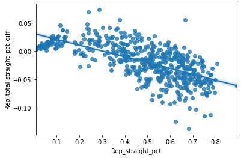

It's the same super statistically significant downward linear trend. It's not as steep as in 2020, but still equally "suspicious" according to Ayyadurai's theory. What about the following counties:

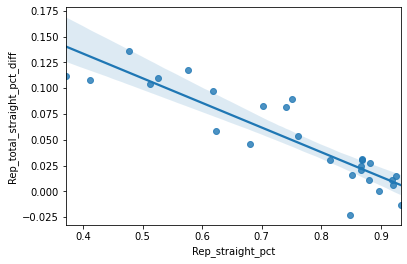
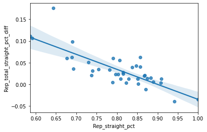
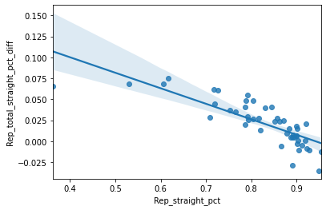
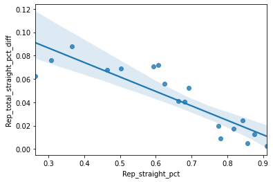
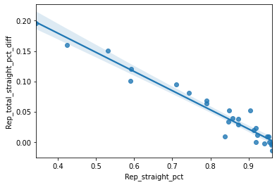
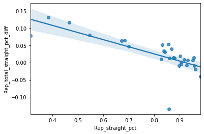

Do these charts get your pattern researcher taste-buds salivating? Ready to take to the Twitters and yell fraud? Before you do, I should say this is data from Randoph, Jackson, Walker, Autauga, Geneva, and Fayette counties...in Alabama (2016 election)[^3]. This is obviously not the first state that comes to mind when you think of election hacking targets; the state hasn't voted for a Democrat president since Jimmy Carter in '76. 

I admit, I cherry-picked some of the "worst" counties above, but the same trend holds throughout. Running Ayyadurai's analysis on all Alabama counties in 2016, **70% of them showed a negative, statistically significant slope** (in other words β < 0 and p < 0.05). In fact, only 13 of the 67 counties were "normal" by Dr. Shiva's definition, showing no significant trend either way. 

## So...Now What?

Now we are at a crossroads. We've got a theory for why such patterns could exist completely legitimately, and the data shows these "suspicious" patterns seem to be the norm. 

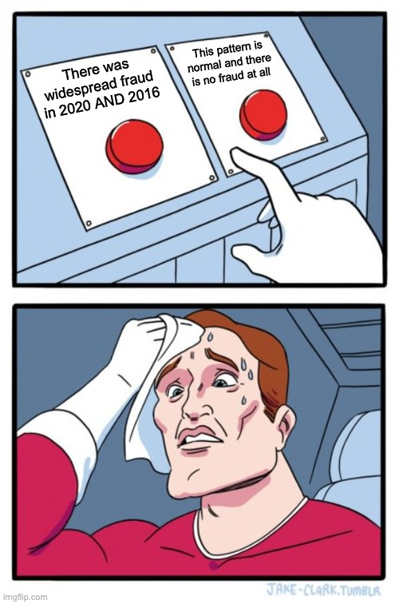 

I'd go with "there was no fraud" (at least of this kind). Dr. Shiva essentially cooked up a graph of "do mixed-party voters vote less partisan than fully partisan voters?" It's almost a tautology, and if considered carefully, you'd expect a trend. I don't know if my explanation is 100% correct, but it's certainly much better supported by the data than Dr. Shiva's theory that "trends are anomalous and signify fraud." 

Is Dr. Shiva lying to us then? Probably not. The selection bias he overlooked is easy to miss, and even the best data gurus out there make mistakes in identifying them.

Was Dr. Shiva doing good science and just happened to mess up? No, absolutely not. He and his team didn't do even the most basic checks to support their theory, i.e. the checks I did above with 2016 election data (by myself in less than a day's work). Even so, they decided to go ahead and claim there was a clear sign of fraud in Michigan, and publish this to their 200k trusting subscribers. Nothing could be more scientifically irresponsible, especially for a man that claims over and over again to be following the principles of science. Now I'm starting to wonder...did he really invent email?

_Code and data used to generate this analysis can be [found on Github](https://github.com/cyniphile/vote-investigation)_.

[^1]: The invention of email is generally credited to Ray Tomlinson around 1970, though Ayyadurai does hold <a href='https://techland.time.com/2011/11/15/the-man-who-invented-email/'>the first copyright</a> to the term dated 1982.

[^2]: We are making a couple of big assumptions here: 1) that the ratio of split-ticket/mixed-ticket votes is uncorrelated with a precinct's party leaning. 2) that the proportion of voters who flip is uncorrelated with a precinct's party leaning. If either assumption is violated in the right way, you could see flat graphs like Dr. Shiva is showing. Ultimately, we simply need to look to the data to see if graphs with lots of slope are the norm or not.

[^3]: Alabama was the only state I could find with both straight-ticket voting and (sort of) readily available voting data. 2020 data was not yet available at the time of this writing. If you find more, let me know!
